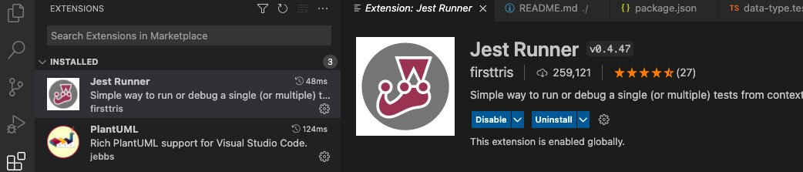
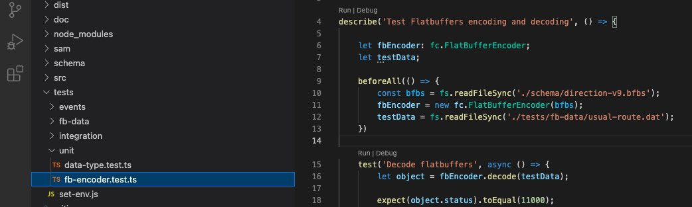

# Commute Route Service (AWS Lambda) 

Commute between home and work is most common scenario of navigation. With users' driving history, navigation system can predict their destionation to home or work and provide them personal usual driving route at the current time. Predicted destination and personal route during commute can improve user experience significantly with minimum development effort. [Design of Commute Route Service](doc/service-design.md) describes how the service interact with other navigation services and how service modules implement commute route features.  

AWS Lambda is a serverless compute service that lets us run code without provisioning or managing servers, creating workload-aware cluster scaling logic, maintaining event integrations, or managing runtimes. With Lambda, we can run code for virtually any type of application or backend service - all with zero administration. Just upload our code as a ZIP file or container image, and Lambda automatically and precisely allocates compute execution power and runs our code based on the incoming request or event, for any scale of traffic. 

Commute Route Service implement Lambda functions in Node.js and use AWS SAM to build, test, and deploy the serivice. To run and edit Commute Route project, please make sure local environment has installed Node.js using command `node --version`. If not, please [install Node.js](https://nodejs.org/en/), including the NPM package management tool. After make Commute Route Service runnable locally, please see [SAM of Commute Route Servcie](sam/README.md) for build, deploy to AWS environment.

## Setting Up 

### 1. Clone the project git repository into local workspace:

```bash
workspace$> git clone https://bitbucket.telenav.com/scm/nav/commute-route.git
```

### 2. Intall runtime dependencies and development dependencies:

Enter into folder commute-route and install depencies by NPM package management tool.

```bash
commute-route$> npm install
```

The dependencies are defined in ./package.json. Installed dependencies will be saved into folder `./node_modules`.

**Runtime dependencies:**

* Axios - promise based HTTP client for node.js.
* Flatbuffers - efficient cross platform serialization library.

**Development dependencies:**

* TypeScript - adds optional types to JavaScript that support tools for large-scale JavaScript applications. 
* Jest - delightful JavaScript testing.

### 3. Transcompile TypeScript files to JavaScript files

```bash
commute-route$> npm run build 
```

It runs build script defined in ./package.json. Transcompiled JavaScript files will be saved into folder `./dist`. 

### 4. Run unit test and integration test

```bash
commute-route$> npm run test 
```

It runs test script defined in ./package.json. Test coverage resport will be saved into folder `./coverage`.

Integration test need call Telenav internal Routing/Matching servers, please make sure run test inside corporation internal network.

## Debugging in IDE

[`Visual Studio Code`](https://code.visualstudio.com/download) is an integrated development environment made by Microsoft for a variety of programming languages, including Java, JavaScript, Go, Node.js, Python and C++. It is based on the Electron framework, which is used to develop Node.js Web applications that run on the Blink layout engine. 

`Jest` is a JavaScript testing framework maintained by Facebook. It focus on simplicity and support for large web applications. Jest does not require a lot of configuration for first time users of a testing framework.



`Jest Runner` extension on `Visual Studio Code` IDE provides simple way to run a test function or test-suite from context-menu.  


