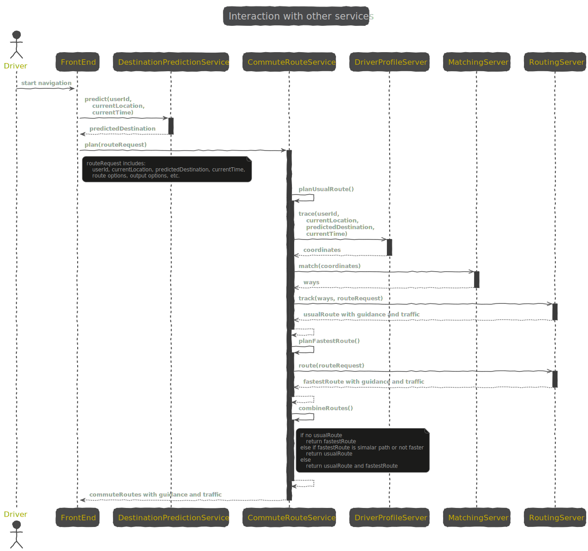
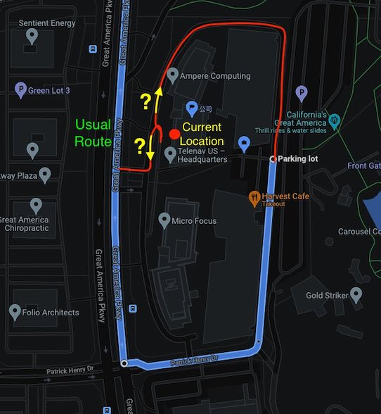
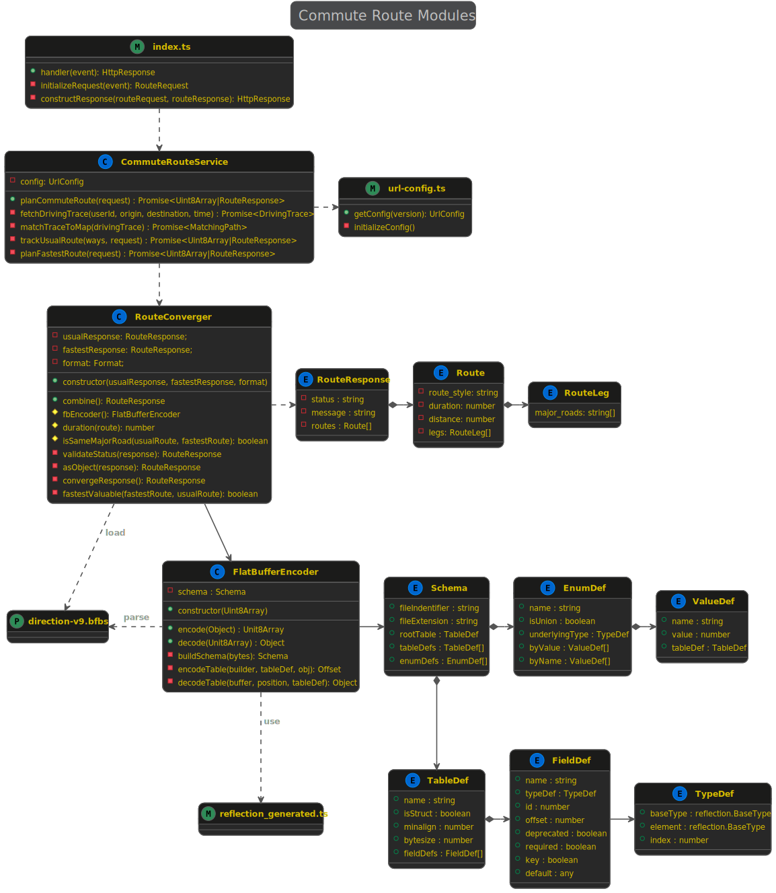

# Desgin of Commute Route Service

Usually, drivers prefer one route when commute to work or home. Considering traffic, ETA of usaul route may change every day. Sometimes, there might be another different route faster than personal usual route. It is neccesary to present such better fastest route with usual route to drivers. In Commute Route Service, we focus on USAUL route and FASTEST route as well as their comparison. Routing server, Traffic server, Matching server are core navigation backend servers. Commute Route Sevice reuse those servers and provides additional features. 

## Interaction with other navigation services 

FrontEnd call DestinationPrediction Service to get the most possible destination for current user at current time. The predicted destination replaces user searched destination (zeor box search) as route request parameters.

After confirmed the destination, FrontEnd call CommouteRoute Service to plan routes to destination. Returned routes could usual route, fastest route, or both of them. CommouteRoute Service reuse same route request and route response schema as direction service. We defined a new route style "USUAL" in schema.

CommuteRoute API versions to Direction API versions:

* V0: direction v8, only json format result
* V1: direction v9, json and flatbuffers format result

### Usual Route 

* Usual route between one origin/destination pair could one route or empty if no commute driving trace.
* DriverProfileServer 
  - Provides simplified personal route feature. 
  - Occurrence and selection of usual route is inside DriverProfileServer, not expose to FrontEnd.
* MatchingServer
  - Standalone server, it could be OSRM Server or Graph Server.
  - DriverProfileServer also can do map matching offline and provide matched route way id list (need resolve map data version inconsistency). Map matching can cluster GPS trace by data attributes (e.g. parking lot road type) 
* RoutingServer - track usual route
  - Route request parameters, e.g. output option, need to be sent to routing server for route tracking. 
  - Current location might not be start point of usual route, need do short routing from current location to usual route (avoid detour in parking lot): a) path to start point of trimmed usual route; or b) path to nearest way on the route. 

&emsp;&emsp;&emsp;

### Fastest Route

 * All route request parameters need to be sent to routing server for route planning. 
 * If there is another fastest route and obviously faster than usual route or no usual route, see [requirement](https://spaces.telenav.com:8443/display/TAS/Commute+Mode+-+Direction+Support), add it into commute route result.

## Commute Route Modules 

AWS Lambda entry point is configured by property Handler. In Commute Route project, Handler function is defined in src/index.ts file, which will be transcompiled as dist/index.js. 

### Commute Route Service 

- Interact with other navigation backend services, including fetch usual driving trace, match usual trace to map, track usual path from origin to destination, plan separate fastest route.
- Call RouteConverger to combine usual route and fastest route

### Combine Route Response 

- Call FlatBufferEncoder to decode flatbuffers data as Json object if response from routing server is flatbuffers format.
- Determine whether fastest route is valuable for drivers
- Combine routes and messages into one route response object
- Call FlatBufferEncoder to encode flatbuffers data as Json object if response to client is flatbuffers format.

### FlatBuffers Encoding and Decoding 

- Utility class for flatbuffers data format
- Parse flatbuffers schema definition from '*.bfbs' file by reflection.
- Decode any data structure supported by flatbuffers
- Encode any data structure supported by flatbuffers